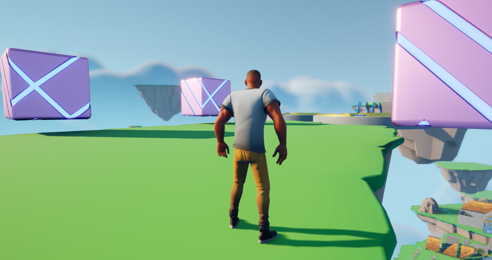

<h1 align="center">Obstacle Assault</h1>

A Fall Guys mimic to pratice in UE5

 

     
    
    
    
    
    

 

    <a href="#-about-the-project">About the project</a> •
    <a href="#-license">License</a> •
    <a href="#-contact">Contact</a> 

## 💻 About the project

This project is part of an ongoing development of my skills in both Unreal Engine and C++. In this project, most of it mechanics were made using C++. The project shows how versatile the Unreal Engine can be in the hands of someone that knows programming.
The demo mimics the game mechanics of games like Fall Guys.
 

 

### Built with
Apart Unreal Engine 5, I used the following tools to build this project.

- [VisualStudio 2022][visualstudio]

## 📃 License

Distributed under the MIT License. See [LICENSE](./LICENSE) for more information.

## 🌟 Contact

Hey :D

If you wanna get in touch, fell free to contact me at:

[LinkedIn][linkedin]

---

Made by Venicio Augusto 

<!-- LINKS-->

[visualstudio]: https://visualstudio.microsoft.com/vs/
[mysql]: https://www.mysql.com/

[linkedin]: https://www.linkedin.com/in/venicio-augusto/